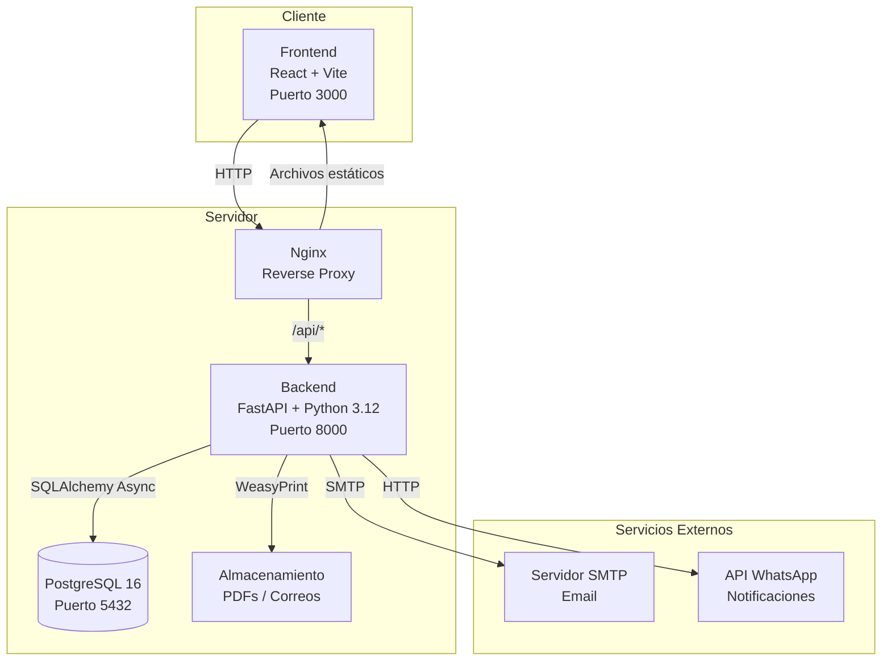

# 🧪 LabResultados — Sistema de Gestión de Resultados de Laboratorio

Sistema integral para la gestión, carga masiva y distribución de resultados de laboratorio clínico. Permite la carga de resultados mediante archivos Excel, generación automática de PDFs, y notificación a pacientes por correo electrónico y WhatsApp.

---

## 📐 Arquitectura del Sistema



---

## 📋 Prerrequisitos

| Herramienta | Versión mínima | Uso                        |
|-------------|---------------|----------------------------|
| Python      | 3.12          | Backend API                |
| Node.js     | 22 LTS        | Frontend                   |
| Docker      | 24+           | Contenedores               |
| Docker Compose | 2.20+      | Orquestación               |
| PostgreSQL  | 16            | Base de datos (o via Docker)|

---

## 🚀 Inicio Rápido con Docker

```bash
# Clonar el repositorio
git clone <url-del-repositorio>
cd LaboratorioExt

# Construir e iniciar todos los servicios
docker-compose up --build

# En otra terminal, ejecutar los datos semilla (primera vez)
docker-compose exec backend python -m seed.seed_data
```

**Servicios disponibles:**

| Servicio  | URL                          |
|-----------|------------------------------|
| Frontend  | http://localhost:3000         |
| API Docs  | http://localhost:8000/docs    |
| ReDoc     | http://localhost:8000/redoc   |
| PostgreSQL| localhost:5432               |

---

## 🛠️ Configuración de Desarrollo (Manual)

### Backend

```bash
cd backend

# Crear entorno virtual
python -m venv venv

# Activar entorno virtual
# Windows:
venv\Scripts\activate
# Linux/Mac:
source venv/bin/activate

# Instalar dependencias
pip install -r requirements.txt

# Copiar archivo de configuración
cp .env.example .env
# Editar .env con tus valores locales

# Ejecutar migraciones
alembic upgrade head

# Cargar datos semilla
python -m seed.seed_data

# Iniciar servidor de desarrollo
uvicorn app.main:app --reload --host 0.0.0.0 --port 8000
```

### Frontend

```bash
cd frontend

# Instalar dependencias
npm install

# Iniciar servidor de desarrollo
npm run dev
```

El frontend estará disponible en `http://localhost:5173` (modo desarrollo).

---

## 🔑 Credenciales por Defecto

| Campo    | Valor      |
|----------|------------|
| Usuario  | `admin`    |
| Contraseña | `admin123` |

> ⚠️ **Importante:** Cambiar las credenciales por defecto en entornos de producción.

---

## 📖 Documentación de la API

La documentación interactiva de la API está disponible en:

- **Swagger UI:** http://localhost:8000/docs
- **ReDoc:** http://localhost:8000/redoc

### Endpoints principales

| Método | Endpoint                     | Descripción                           |
|--------|------------------------------|---------------------------------------|
| POST   | `/api/auth/login`            | Iniciar sesión                        |
| GET    | `/api/dashboard`             | Estadísticas del dashboard            |
| GET    | `/api/pruebas`               | Catálogo de pruebas                   |
| POST   | `/api/pruebas`               | Crear prueba                          |
| POST   | `/api/lotes/upload`          | Cargar archivo Excel                  |
| GET    | `/api/lotes`                 | Listar lotes de carga                 |
| GET    | `/api/lotes/{id}`            | Detalle de lote                       |
| POST   | `/api/lotes/{id}/procesar`   | Procesar lote (generar PDFs)          |
| POST   | `/api/lotes/{id}/notificar`  | Enviar notificaciones                 |
| GET    | `/api/pacientes`             | Listar pacientes                      |
| GET    | `/api/resultados/{id}/pdf`   | Descargar PDF de resultado            |

---

## 📊 Formato del Archivo Excel

El archivo Excel para carga masiva debe contener las siguientes columnas:

| Columna                | Tipo     | Requerido | Descripción                                    | Ejemplo                    |
|------------------------|----------|-----------|------------------------------------------------|----------------------------|
| `Identificacion_Paciente` | Texto | ✅        | ID único del paciente (CURP, cédula, etc.)     | `GARM850315HDFRRL09`       |
| `Nombre_Paciente`      | Texto    | ✅        | Nombre(s) del paciente                         | `María Elena`              |
| `Apellido_Paciente`    | Texto    | ✅        | Apellido(s) del paciente                       | `García Ramírez`           |
| `Fecha_Nacimiento`     | Fecha    | ✅        | Fecha de nacimiento                            | `1985-03-15`               |
| `Sexo`                 | Texto    | ✅        | Sexo del paciente (M/F)                        | `F`                        |
| `Telefono_Paciente`    | Texto    | ❌        | Teléfono de contacto                           | `+52 55 1234 5678`         |
| `Email_Paciente`       | Texto    | ❌        | Correo electrónico                             | `maria@email.com`          |
| `WhatsApp_Paciente`    | Texto    | ❌        | Número de WhatsApp                             | `+52 55 1234 5678`         |
| `Cedula_Medico`        | Texto    | ✅        | Cédula profesional del médico                  | `12345678`                 |
| `Nombre_Medico`        | Texto    | ✅        | Nombre completo del médico                     | `Dr. Carlos López`         |
| `Especialidad_Medico`  | Texto    | ❌        | Especialidad médica                            | `Medicina General`         |
| `Codigo_Prueba`        | Texto    | ✅        | Código de la prueba del catálogo               | `GLU`                      |
| `Valor`                | Numérico | ✅        | Valor numérico del resultado                   | `95.5`                     |
| `Fecha_Toma`           | Fecha    | ✅        | Fecha de toma de muestra                       | `2026-07-10`               |
| `Fecha_Resultado`      | Fecha    | ✅        | Fecha del resultado                            | `2026-07-10`               |
| `Observaciones`        | Texto    | ❌        | Notas adicionales                              | `Muestra hemolizada`       |

### Notas sobre el formato:
- Las fechas aceptan formatos: `YYYY-MM-DD`, `DD/MM/YYYY`, `MM/DD/YYYY`
- Los nombres de columna no distinguen mayúsculas/minúsculas
- Los espacios en nombres de columna se normalizan automáticamente

---

## ⚙️ Variables de Entorno

| Variable                     | Valor por defecto                              | Descripción                          |
|------------------------------|-----------------------------------------------|--------------------------------------|
| `DATABASE_URL`               | `postgresql+asyncpg://...`                    | URL de conexión a PostgreSQL         |
| `SECRET_KEY`                 | `production-secret-key-change-this`           | Clave secreta para JWT               |
| `ALGORITHM`                  | `HS256`                                       | Algoritmo de firma JWT               |
| `ACCESS_TOKEN_EXPIRE_MINUTES`| `480`                                         | Duración del token (minutos)         |
| `LAB_NAME`                   | `Laboratorio Clínico`              | Nombre del laboratorio               |
| `LAB_ADDRESS`                | `Av. Principal #123, Col. Centro`             | Dirección del laboratorio            |
| `LAB_PHONE`                  | `+52 55 1234 5678`                            | Teléfono del laboratorio             |
| `LAB_EMAIL`                  | `contacto@labsanrafael.com`                   | Email del laboratorio                |
| `MOCK_EMAIL`                 | `true`                                        | Simular envío de correos             |
| `MOCK_WHATSAPP`              | `true`                                        | Simular envío de WhatsApp            |
| `PDF_STORAGE_PATH`           | `/app/storage/pdfs`                           | Ruta de almacenamiento de PDFs       |
| `BASE_URL`                   | `http://localhost:8000`                        | URL base de la aplicación            |

---

## 📁 Estructura del Proyecto

```
LaboratorioExt/
├── docker-compose.yml          # Orquestación de servicios
├── .gitignore                  # Archivos ignorados por Git
├── README.md                   # Este archivo
│
├── backend/
│   ├── Dockerfile              # Imagen Docker del backend
│   ├── requirements.txt        # Dependencias Python
│   ├── alembic.ini             # Configuración de Alembic
│   ├── .env.example            # Ejemplo de variables de entorno
│   │
│   ├── app/
│   │   ├── main.py             # Punto de entrada FastAPI
│   │   ├── config.py           # Configuración de la aplicación
│   │   ├── database.py         # Conexión a base de datos
│   │   ├── models/             # Modelos SQLAlchemy
│   │   ├── schemas/            # Esquemas Pydantic
│   │   ├── routers/            # Endpoints de la API
│   │   ├── services/           # Lógica de negocio
│   │   └── utils/              # Utilidades (PDF, email, etc.)
│   │
│   ├── seed/
│   │   ├── seed_data.py        # Datos semilla
│   │   ├── create_example_excel.py  # Generador de Excel ejemplo
│   │   └── ejemplo_resultados.xlsx  # Excel de ejemplo generado
│   │
│   ├── tests/
│   │   ├── conftest.py         # Fixtures de pruebas
│   │   ├── test_excel_parser.py # Tests del parser Excel
│   │   └── test_api.py         # Tests de la API
│   │
│   ├── alembic/                # Migraciones de base de datos
│   └── storage/                # Almacenamiento local (PDFs, correos)
│
└── frontend/
    ├── Dockerfile              # Imagen Docker del frontend
    ├── nginx.conf              # Configuración Nginx
    ├── package.json            # Dependencias Node.js
    ├── vite.config.ts          # Configuración Vite
    ├── src/
    │   ├── main.tsx            # Punto de entrada React
    │   ├── App.tsx             # Componente principal
    │   ├── components/         # Componentes reutilizables
    │   ├── pages/              # Páginas de la aplicación
    │   ├── services/           # Llamadas a la API
    │   ├── hooks/              # Custom hooks
    │   └── types/              # Definiciones TypeScript
    └── public/                 # Archivos estáticos
```

---

## 🔗 Integración de n8n y Cloudflare Tunnel (Cuestionarios desde Casa)

El proyecto incluye soporte nativo en Docker para levantar **n8n** y **Cloudflare Tunnel** de forma conjunta en tu servidor local o máquina virtual:

1. **Configurar Variables**:
   Copia el archivo `.env.example` en la raíz del proyecto como `.env`:
   ```bash
   cp .env.example .env
   ```
   Edita el archivo `.env` y añade tu token de túnel (`CLOUDFLARE_TUNNEL_TOKEN`) y la URL pública de n8n (`N8N_PUBLIC_URL`).

2. **Levantar el Stack Completo**:
   ```bash
   docker-compose up -d --build
   ```

3. **Importar Cuestionario Clínico**:
   - Accede a n8n localmente en `http://localhost:5678`.
   - Crea un nuevo flujo de trabajo y pega el contenido JSON de `scratch/n8n_cuestionario_workflow.json` presionando `Ctrl + V`.
   - En tu consola de **Cloudflare Zero Trust**, apunta tu subdominio público (ej. `cuestionarios.tuclinica.com`) al servicio local de Docker `http://n8n:5678`.

---

## 📸 Capturas de Pantalla

> _Próximamente: capturas de pantalla de las principales funcionalidades._

| Pantalla           | Descripción                              |
|--------------------|------------------------------------------|
| Login              | Inicio de sesión                         |
| Dashboard          | Panel principal con estadísticas         |
| Carga de Excel     | Interfaz de carga masiva de resultados   |
| Detalle de Lote    | Revisión de resultados cargados          |
| PDF de Resultado   | Vista previa del PDF generado            |

---

## 🧪 Ejecución de Pruebas

```bash
cd backend

# Ejecutar todas las pruebas
pytest

# Ejecutar con cobertura
pytest --cov=app --cov-report=html

# Ejecutar pruebas específicas
pytest tests/test_excel_parser.py -v
pytest tests/test_api.py -v
```

---

## 📄 Licencia

Este proyecto es de uso privado para el **Laboratorio Clínico**.

---

## 👥 Contacto

- **Email:** contacto@labsanrafael.com
- **Teléfono:** +52 55 1234 5678
